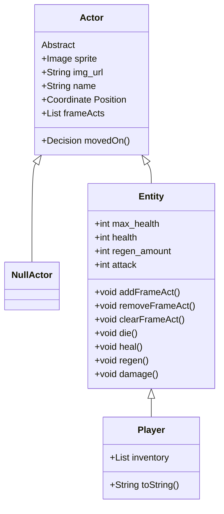

# CS161-2023-DungeonCrawler

## Project Introduction 

The Dungeon Crawler project is a project idea generated by my CS-161 class at PFW. The project is aimed to be completed this semester, and hopefully serves us well in learning different concepts related to application development. It is designed using the Java programming language and JFX library. I will attempt top document properly the structure, reasoning, and design of the project. 

## Project Structure Overview

The Dungeon Crawler is supposed to be completed in an Object Oriented manner, and has the following goal criteria:
 - 4 directional player movement
 - Player ability to enter different "levels"
 - Player cannot move into rocks
 - Player can pass traps, but will be damaged
 -  + Implies existence of traps
 - Enemies have 4 directional movement
 - Enemies try moving towards the player
 - Player can damage enemies, and can defeat enemies. 
 - Enemies can damage the player (and likely attempt to on their turn)
 - Player recovers health when using potion
 - Progress can be saved/loaded
 - Player can lose the game

Object Oriented design, to me, is about "messaging" and "compartmentalization". Messaging refers to being able to, rather than make a change yourself, "message" or request that change from whoever is responsible for it. Compartmentalization refers to separating up the responsibility so that everything that needs done is done as independently as possible from other pieces. 

This in mind, my perception of the criteria makes me plan for the following in terms of state and function: 

## Project Class Structure 

### Actor Classes

