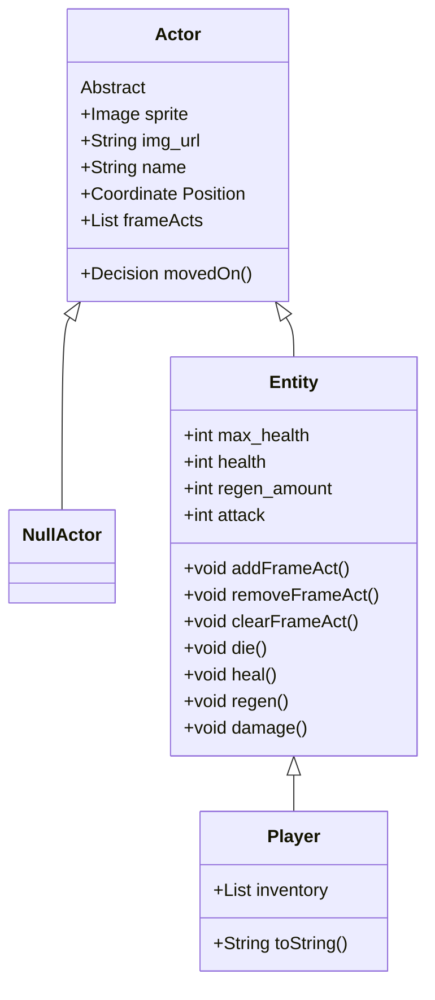

# CS161-2023-DungeonCrawler

## Project Introduction 

The Dungeon Crawler project is a project idea generated by my CS-161 class at PFW. The project is aimed to be completed this semester, and hopefully serves us well in learning different concepts related to application development. It is designed using the Java programming language and JFX library. I will attempt top document properly the structure, reasoning, and design of the project. 

## Project Structure Overview

The Dungeon Crawler is supposed to be completed in an Object Oriented manner, and has the following goal criteria:
 - 4 directional player movement
 - Player ability to enter different "levels"
 - Player cannot move into rocks
 - Player can pass traps, but will be damaged
    + Implies existence of traps
 - Enemies have 4 directional movement
 - Enemies try moving towards the player
 - Player can damage enemies, and can defeat enemies. 
 - Enemies can damage the player (and likely attempt to on their turn)
 - Player recovers health when using potion
 - Progress can be saved/loaded
 - Player can lose the game

Object Oriented design, to me, is about "messaging" and "compartmentalization". Messaging refers to being able to, rather than make a change yourself, "message" or request that change from whoever is responsible for it. Compartmentalization refers to separating up the responsibility so that everything that needs done is done as independently as possible from other pieces. I let these ideas mold how I want to structure each of the project components. 

I want the TileMap to act as an intermediate manager of the state of the tiles. It doesn't need to be aware of the things on it, or what they look like. It only needs to relay requests to move into a position to the holder of that position, process how they respond, and forward that info back to the requestor. This means the behavior of the requestor, the tilemap, and the current tile-holder, are all independent of one another. To ensure that this feature is shared across all members of the TileMap, I create the functionality within the overarching ```Actor``` class.

I want for the Actors on the board to all be able to process and respond to movement requests in the tilemap, and I hope for them to all be able to have behaviors on every 'frame' or 'tick' of the game. Because of this, I will implement whatever methods I choose to allow that in the overarching ```Actor``` class as well. For empty spaces and traps, I'm thinking special instances of the actor class will work well. This would allow the same source code to be extended, increasing compatability, while not negatively affecting any functionality. 

I want entities that move and get damaged to be of their own type, specializing in that behavior, and so I make a shared ```Entity``` class to cover them. The Player and all Enemy variants should derive from this class. 

In terms of saving, I'm thinking of either a JSON format, or Object serialization method. If neither of those seem manageable at this scale, I might just convert everything to bytes, and come up with a way of parsing that back in. 

I want to use state-based logic to control the gameloop and scenes, and I want to tie the 'tick' of the game to player input. Thus, the game will only process the loop on user input. 

## Project Class Structure 

This represents the actual structure of the classes and Gameloop within the game. 

### Actor Classes


