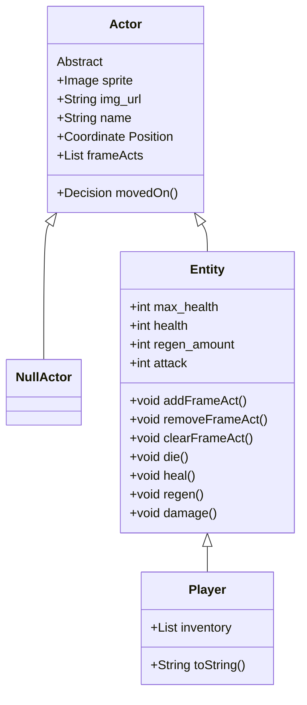

# CS161-2023-DungeonCrawler

```mermaid
classDiagram
    Actor <|-- NullActor
    Actor <|-- Entity
    Entity <|-- Player
    Actor:  Abstract
    Actor: +Image sprite
    Actor: +String img_url
    Actor: +String name
    Actor: +Coordinate Position
    Actor: +List<Act> frameActs
    Actor: +Decision movedOn()

    class NullActor{

    }
    class Entity{
      +int max_health
      +int health
      +int regen_amount
      +int attack
      +void addFrameAct()
      +void removeFrameAct()
      +void clearFrameAct()
      +void die()
      +void heal()
      +void regen()
      +void damage()
    }
    class Player{
        +List<Item> inventory
        +String toString()
    }
```
