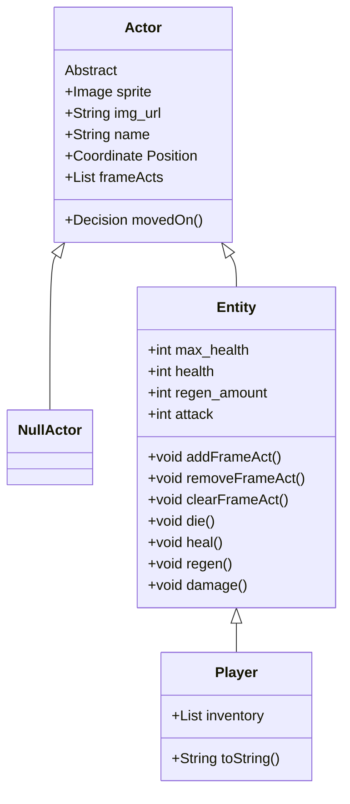

# CS161-2023-DungeonCrawler

## Project Introduction 

The Dungeon Crawler project is a project idea generated by my CS-161 class at PFW. The project is aimed to be completed this semester, and hopefully serves us well in learning different concepts related to application development. It is designed using the Java programming language and JFX library. I will attempt top document properly the structure, reasoning, and design of the project. 

## Project Structure Overview

The Dungeon Crawler is supposed to be completed in an Object Oriented manner, and has the following goal criteria:
 - 4 directional player movement
 - Player ability to enter different "levels"
 - Player cannot move into rocks
 - Player can pass traps, but will be damaged
    + Implies existence of traps
 - Enemies have 4 directional movement
 - Enemies try moving towards the player
 - Player can damage enemies, and can defeat enemies. 
 - Enemies can damage the player (and likely attempt to on their turn)
 - Player recovers health when using potion
 - Progress can be saved/loaded
 - Player can lose the game

Object Oriented design, to me, is about "messaging" and "compartmentalization". Messaging refers to being able to, rather than make a change yourself, "message" or request that change from whoever is responsible for it. Compartmentalization refers to separating up the responsibility so that everything that needs done is done as independently as possible from other pieces. I let these ideas mold how I want to structure each of the project components. 

I want the TileMap to act as an intermediate manager of the state of the tiles. It doesn't need to be aware of the things on it, or what they look like. It only needs to relay requests to move into a position to the holder of that position, process how they respond, and forward that info back to the requestor. This means the behavior of the requestor, the tilemap, and the current tile-holder, are all independent of one another. To ensure that this feature is shared across all members of the TileMap, I create the functionality within the overarching ```Actor``` class.

I want for the Actors on the board to all be able to process and respond to movement requests in the tilemap, and I hope for them to all be able to have behaviors on every 'frame' or 'tick' of the game. Because of this, I will implement whatever methods I choose to allow that in the overarching ```Actor``` class as well. For empty spaces and traps, I'm thinking special instances of the actor class will work well. This would allow the same source code to be extended, increasing compatability, while not negatively affecting any functionality. 

I want entities that move and get damaged to be of their own type, specializing in that behavior, and so I make a shared ```Entity``` class to cover them. The Player and all Enemy variants should derive from this class. 

In terms of saving, I'm thinking of either a JSON format, or Object serialization method. If neither of those seem manageable at this scale, I might just convert everything to bytes, and come up with a way of parsing that back in. 

I want to use state-based logic to control the gameloop and scenes, and I want to tie the 'tick' of the game to player input. Thus, the game will only process the loop on user input. 

## Project Class Code Explanations

#### [Dungeon Crawler Controller :: loadLevel1](https://github.com/arcaniussainey/CS161-2023-DungeonCrawler/blob/main/DungeonCrawler/src/main/java/game/DungeonCrawlerController.java#L66)
This function's job is to load the first level of the game. Most importantly, it loads the "level" scene, onto which levels can actually be drawn. 

To accomplish this it must find the canvas instance in the new scene and set our variable to it. Once it does that, it checks for a save-file and tries to setup the player and stage state. This could also be where our tilemap is setup, and so it will likely steal that from initialize, and undergo a renaming. 
```Java 
@FXML // make visible to FXML
	void loadLevel1(ActionEvent event) throws Throwable {
		String name = nameTxt.getText();
		loadScene(event, "level1.fxml");
		
		for (Object ob : root.getChildrenUnmodifiable()) {
   // search from scene root for canvas objects
			if (ob instanceof Canvas) {
				this.scene_canvas = (Canvas) ob;
    // set to canvas object, if it is confirmed to be an instance of Canvas
			}
		}
		// this is the only way out of start, so we'll change scene here
		boolean proper_save = loadSaveFile();
  // loadSaveFile returns true if it succeeds. 
		if (!proper_save) {
   // if the save file failed then we simply create a new player in the start coordinate. May later decide to make the start coordinate a map variable.  
			player_character = new Player(name, new Coordinate(0, 0), 100, 10, 1, 4);
			DungeonCrawlerController.game_map.setActor(new Coordinate(2, 2), player_character); // place the player in middle of scene. Use set actor as it ensures both the tilemap and the entity know their positions. 
		}
		current_stage = StageState.GAME;
		Render(); // call the canvas render
	}
```

#### [Dungeon Crawler Controller :: initialize](https://github.com/arcaniussainey/CS161-2023-DungeonCrawler/blob/main/DungeonCrawler/src/main/java/game/DungeonCrawlerController.java#L59)
I make this function accessible to JavaFX because it is the first thing JavaFX runs. the goal of this function is to initialize everything that will actually be used to control the game behind the scenes. 

Most importantly is making sure that everything our scene needs is setup, so the states for the state-machine, and the tilemap. When map loading is added, it will be more logical to just call the function that handles the map-file and default rather than directly set the tilemap. 

```Java 
@FXML
	public void initialize() {
		// "this" corresponds to DungeonCrawlerController, but we don't use it because it's a static variable
		DungeonCrawlerController.game_map = new TileMap(15, 15);
  // sets up map
  
		DungeonCrawlerController.current_stage = StageState.START;
		DungeonCrawlerController.game_state = GameState.PLAYERMOVE;
  // sets up state machine variables. 
	}
```

## Project Class Structure 

This represents the actual structure of the classes and Gameloop within the game. 

### Actor Classes


