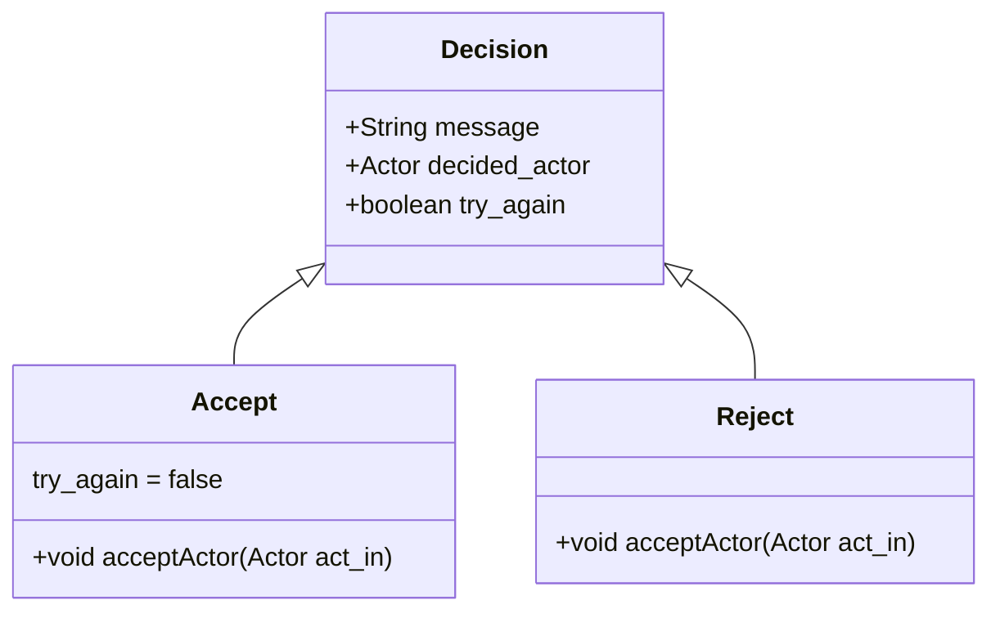
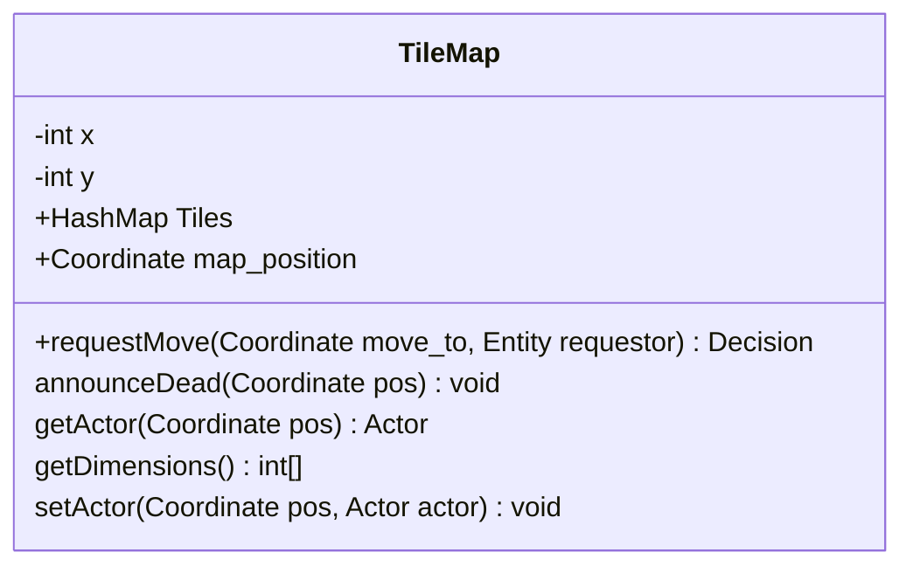
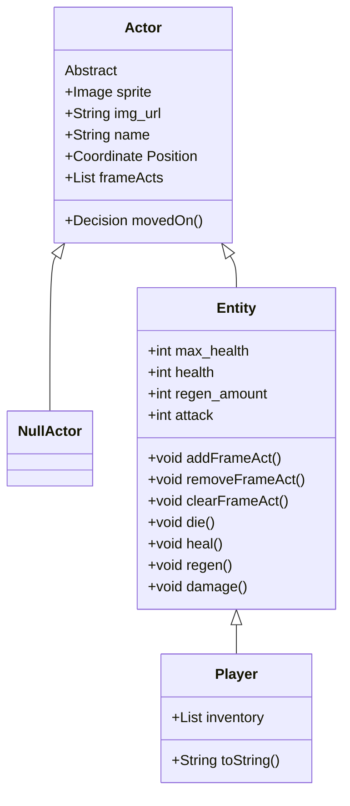
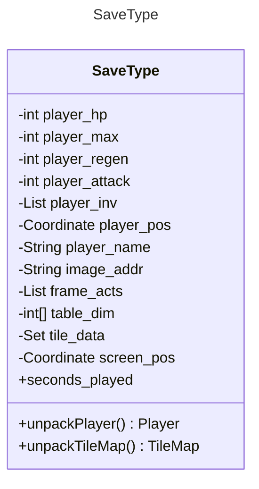

# CS161-2023-DungeonCrawler

## Project Introduction 

The Dungeon Crawler project is a project idea generated by my CS-161 class at PFW. The project is aimed to be completed this semester, and hopefully serves us well in learning different concepts related to application development. It is designed using the Java programming language and JFX library. I will attempt top document properly the structure, reasoning, and design of the project. 

## Project Structure Overview

The Dungeon Crawler is supposed to be completed in an Object Oriented manner, and has the following goal criteria:
 - 4 directional player movement
 - Player ability to enter different "levels"
 - Player cannot move into rocks
 - Player can pass traps, but will be damaged
    + Implies existence of traps
 - Enemies have 4 directional movement
 - Enemies try moving towards the player
 - Player can damage enemies, and can defeat enemies. 
 - Enemies can damage the player (and likely attempt to on their turn)
 - Player recovers health when using potion
 - Progress can be saved/loaded
 - Player can lose the game

Object Oriented design, to me, is about "messaging" and "compartmentalization". Messaging refers to being able to, rather than make a change yourself, "message" or request that change from whoever is responsible for it. Compartmentalization refers to separating up the responsibility so that everything that needs done is done as independently as possible from other pieces. I let these ideas mold how I want to structure each of the project components. 

I want the TileMap to act as an intermediate manager of the state of the tiles. It doesn't need to be aware of the things on it, or what they look like. It only needs to relay requests to move into a position to the holder of that position, process how they respond, and forward that info back to the requestor. This means the behavior of the requestor, the tilemap, and the current tile-holder, are all independent of one another. To ensure that this feature is shared across all members of the TileMap, I create the functionality within the overarching ```Actor``` class.

I want for the Actors on the board to all be able to process and respond to movement requests in the tilemap, and I hope for them to all be able to have behaviors on every 'frame' or 'tick' of the game. Because of this, I will implement whatever methods I choose to allow that in the overarching ```Actor``` class as well. For empty spaces and traps, I'm thinking special instances of the actor class will work well. This would allow the same source code to be extended, increasing compatability, while not negatively affecting any functionality. 

I want entities that move and get damaged to be of their own type, specializing in that behavior, and so I make a shared ```Entity``` class to cover them. The Player and all Enemy variants should derive from this class. 

In terms of saving, I'm thinking of either a JSON format, or Object serialization method. If neither of those seem manageable at this scale, I might just convert everything to bytes, and come up with a way of parsing that back in. 

I want to use state-based logic to control the gameloop and scenes, and I want to tie the 'tick' of the game to player input. Thus, the game will only process the loop on user input. 

## Project Class Code Explanations

#### 

#### [Dungeon Crawler Controller :: loadLevel1](https://github.com/arcaniussainey/CS161-2023-DungeonCrawler/blob/main/DungeonCrawler/src/main/java/game/DungeonCrawlerController.java#L66)
This function's job is to load the first level of the game. Most importantly, it loads the "level" scene, onto which levels can actually be drawn, and sets the variable for the players name. 

```Java 
@FXML // make visible to FXML
	void loadLevel1(ActionEvent event) throws Throwable {
		String name = nameTxt.getText();
		loadScene(event, "level1.fxml");
```

To allow the TileMap to be drawn, we must find the scene canvas. We do this by looping all objects under the scene root, and checking if they're an instance of the Canvas class. 
```Java
		
		for (Object ob : root.getChildrenUnmodifiable()) {
   			// search from scene root for canvas objects
			if (ob instanceof Canvas) {
				this.scene_canvas = (Canvas) ob;
   				 // set to canvas object, if it is confirmed to be an instance of Canvas
			}
		}
		// this is the only way out of start, so we'll change scene here
```
We must also load the save, change the scene, instantiate the player, and render the tilemap
``` Java
		boolean proper_save = loadSaveFile();
  		// loadSaveFile returns true if it succeeds. 
		if (!proper_save) {
   		// if the save file failed then we simply create a new player in the start coordinate. May later decide to make the start coordinate a map variable.  
			player_character = new Player(name, new Coordinate(0, 0), 100, 10, 1, 4);
			DungeonCrawlerController.game_map.setActor(new Coordinate(2, 2), player_character); // place the player in middle of scene. Use set actor as it ensures both the tilemap and the entity know their positions. 
		}
		current_stage = StageState.GAME;
		Render(); // call the canvas render
	}
```

#### [Dungeon Crawler Controller :: initialize](https://github.com/arcaniussainey/CS161-2023-DungeonCrawler/blob/main/DungeonCrawler/src/main/java/game/DungeonCrawlerController.java#L59)
I make this function accessible to JavaFX because it is the first thing JavaFX runs. the goal of this function is to initialize everything that will actually be used to control the game behind the scenes. 

Most importantly is making sure that everything our scene needs is setup, so the states for the state-machine, and the tilemap. When map loading is added, it will be more logical to just call the function that handles the map-file and default rather than directly set the tilemap. 

```Java 
@FXML
	public void initialize() {
		// "this" corresponds to DungeonCrawlerController, but we don't use it because it's a static variable
		DungeonCrawlerController.game_map = new TileMap(15, 15);
  		// sets up map
  
		DungeonCrawlerController.current_stage = StageState.START;
		DungeonCrawlerController.game_state = GameState.PLAYERMOVE;
  		// sets up state machine variables. 
	}
```

### State Machine 

The Game's main loop exists within a very simple state machine. First, the state machine uses cases on two enums shown below. 

```Java
public enum StageState {
	START,
	INVENTORY,
	GAME,
	DEATH
}
```

```Java
public enum GameState {
	COMBAT,
	PLAYERMOVE,
	ENEMYMOVE,
	DEATH
}
```


The machine's step invocation (the tick) is linked to user input, within the loadScene method. 

#### [Dungeon Crawler Controller :: loadScene](https://github.com/arcaniussainey/CS161-2023-DungeonCrawler/blob/experimental/DungeonCrawler/src/main/java/game/DungeonCrawlerController.java#L108)
The early setup of the ```loadScene``` method simple grabs the scene root, sets the stage and scene, and shows them. Onto this, we add an event filter for ```KeyEvent.KEY_TYPED``` events. This is what executes out Gameloop, the ```Update``` method. 
```Java
@FXML
void loadScene(ActionEvent event, String sceneName) throws IOException {
	... // lines 109-117
	scene.addEventFilter(KeyEvent.KEY_TYPED,  
		scene_event -> {
				try {
					Update(scene_event);
				} catch (Throwable e) {
					// TODO Auto-generated catch block
					e.printStackTrace();
				}
			}
	);
}
	
```
#### [Dungeon Crawler Controller :: Update](https://github.com/arcaniussainey/CS161-2023-DungeonCrawler/blob/experimental/DungeonCrawler/src/main/java/game/DungeonCrawlerController.java#L152)
This method simple evaluates the current stage of the game, and runs the corresponding stageloop. It switches on the ```current_stage``` which is a StageState enum value of the current stage. The called function returns the next stage of the game. 
```Java
public static void Update(KeyEvent event_in) throws Throwable {
	switch (current_stage) {
		case GAME:
			current_stage = GameLoop(event_in);
			Render();
			break;
			// If we're on the game stage, send all input to the gameloop
		case INVENTORY:
			current_stage = InventoryLoop(event_in);
			// if we're on the inventory stage, send all input to the inventory loop
			break;
		case START:
			break;
			// if we're on the start stage, just ignore it lol
		default:
			break;
		}
}
```

Following this, the loop responsible for processing the corresponding stage runs. At present, that is either the InventoryLoop or the GameLoop. Only GameLoop is implemented as of now, simply because I'm not sure what purpose/use the inventory will have yet. 

#### [Dungeon Crawler Controller :: GameLoop](https://github.com/arcaniussainey/CS161-2023-DungeonCrawler/blob/experimental/DungeonCrawler/src/main/java/game/DungeonCrawlerController.java#L171)
This method evaluates the current state of the game, ```game_state``` which is a GameState enum value. It returns a StageState as the next stage of the game on its completion. 

First we make sure that there will always be a valid stage returned. In this case, it's the stage currently active. This is changed actively, so it's a good default value. 
```Java 
public StageState GameLoop(KeyEvent event_in) {
	StageState NextStage = DungeonCrawlerController.current_stage; // the stage we're going to return
```

Following that, we use a switch statement to evaluate which step of the game it is. We mainly evaluate this to determine what the valid actions for the player will be. Combat and Death are presently unimplemented. 

On ENEMYMOVE we run ```ActorTick``` and set the state for the stage and game. 
```Java 
case ENEMYMOVE:
	ActorTick();
	System.out.println("Enemies did stuff");
	NextStage = StageState.GAME;
	DungeonCrawlerController.game_state = GameState.PLAYERMOVE;
	break;
```

ActorTick simply exists to ensure all actors are updated. It loops over the activites that all actors should take every frame, and invokes their methods. This would include things like health regen, poison or burning, and other constant effects. It's also where Enemy decision making methods should be added, as it will result in them taking their turn. 

#### [Dungeon Crawler Controller :: ActorTick](https://github.com/arcaniussainey/CS161-2023-DungeonCrawler/blob/experimental/DungeonCrawler/src/main/java/game/DungeonCrawlerController.java#L265)
```Java
public void ActorTick() {
	for (Entry<Coordinate, Actor> map_entry : DungeonCrawlerController.game_map.Tiles.entrySet()) {
```
Loops over the set of entries in the hashmap
```Java
		if (map_entry.getValue().frameActs != null) {
```
Makes sure the actor has frame actions (NullActors dont)
```Java
			for (Act performance : map_entry.getValue().frameActs) {
				performance.perform();
			}
}}}
```
Performs the respective actions. 

One method I considered for getting actor movement towards player is taking the coordinate difference between an enemy and a player, and converting it to a normalized vector to get the direction. Then trying to go the closest valid route in that direction. It wouldn't be very "intelligent" seeming, but it'd be simple. For that we would take the X and Y difference, making the largest of the two our normalization max, and divide both the X and Y by that. That would give us the corresponding strength of the direction. We normalize that to either 1 or zero (greater than or equal to .5) to get the cardinal direction, and use the the percentage to decide in the case of the cardinal direction being unavailable. 

```bf
Consider the following examples. @ = empty but valid space, # = wall, $ = player 
    @ @ * @ @ @
    @ @ @ @ @ @
    @ @ @ @ @ @
    @ @ @ @ @ @
    @ @ $ @ @ @

Difference of 0 (X) and -4 (Y), meaning the cardinal direction vector is (0, -1). 


    @ * @ @ @ @
    @ @ @ @ @ @
    @ @ @ @ @ @
    @ @ @ @ @ @
    @ @ $ @ @ @

Difference of 1 (X) and -4 (Y), meaning the cardinal direction vector is (0, -1). But the strength of the x and y directions is .25 (X) and 1 (Y). This helps in the case of something like the following.

    @ * @ @ @ @
    @ # @ @ @ @
    @ @ @ @ @ @
    @ @ @ @ @ @
    @ @ $ @ @ @

If the cardinal direction is unavailable then the actor can rely on the strength of the x and y directions. The y option is unavailable, so it moves right. 

    @ * @ @ @ @
    @ # @ @ @ @
    @ @ @ @ @ @
    @ @ @ @ @ @
    @ @ $ @ @ @
    
Now the cardinal direction is a valid option, so it beelines for the player. 
```

#### [Dungeon Crawler Controller :: GameLoop (continued)](https://github.com/arcaniussainey/CS161-2023-DungeonCrawler/blob/experimental/DungeonCrawler/src/main/java/game/DungeonCrawlerController.java#L171)
The alternative is that it's the PLAYERMOVE state. In that case, we pass the input to evaluate it via the player's input rules. 
```Java 
case PLAYERMOVE:
	NextStage = PlayerAction(event_in);
	break;
```

#### [Dungeon Crawler Controller :: PlayerAction](https://github.com/arcaniussainey/CS161-2023-DungeonCrawler/blob/experimental/DungeonCrawler/src/main/java/game/DungeonCrawlerController.java#L208)
PlayerAction evaluates the ```event_in``` event to determine which character it is, and whether it should react. 

```Java
public StageState PlayerAction(KeyEvent event_in) {
	StageState NextStage = DungeonCrawlerController.current_stage;
	System.out.println(DungeonCrawlerController.player_character);
	Decision move_decision = null;
	System.out.println(event_in.getCharacter().toUpperCase());
``` 
It is of type StageState to set the next stage state of the game. It gives a default value to the NextStage variable, again a good decision. It prints the character's info (this will be removed or formalized in the future). It gives a default value to the decision variable, which is a class indicating whether the move was accepted or rejected. 

```Java 
switch (event_in.getCharacter().toUpperCase().charAt(0))
```
We switch on the first letter of the event, in its uppercase form. The four movement characters WASD are only slight variants of the same structure. They request a movement decision of type ```Decision``` from the TileMap, and they request it in the direction they want to move. The implementation of the Coordinate class means that no math is necessary here. 

If the move is accepted, we move the coordinate of the TileMap. This is only implemented if the ```board_moves``` switch of Render is set to 1. It simply centers the player at all times. 

It then sets the next stage, and continues. In full below: 
```Java 
switch (event_in.getCharacter().toUpperCase().charAt(0)) {
	case 'W':
		// move up
		move_decision = game_map.requestMove(player_character.Position.Forward(), player_character);
		if (move_decision instanceof Accept)
			DungeonCrawlerController.game_map.map_position = DungeonCrawlerController.game_map.map_position.Backward();
		NextStage = StageState.GAME;
		break;
	case 'A':
		// move right
		move_decision = game_map.requestMove(player_character.Position.Left(), player_character);
		if (move_decision instanceof Accept)
			DungeonCrawlerController.game_map.map_position = DungeonCrawlerController.game_map.map_position.Right();
		NextStage = StageState.GAME;
		break;
	case 'S':
		// move left
		move_decision = game_map.requestMove(player_character.Position.Backward(), player_character);
		if (move_decision instanceof Accept)
			DungeonCrawlerController.game_map.map_position = DungeonCrawlerController.game_map.map_position.Forward();
		NextStage = StageState.GAME;
		break;
	case 'D':
		// move down!
		move_decision = game_map.requestMove(player_character.Position.Right(), player_character);
		if (move_decision instanceof Accept)
			DungeonCrawlerController.game_map.map_position = DungeonCrawlerController.game_map.map_position.Left();
		NextStage = StageState.GAME;
		break;
	...
}
```

If the character pressed 'I' we open the inventory, and set the nextstage to be inventory. The inventory is unimplemented still. 
```Java
switch (event_in.getCharacter().toUpperCase().charAt(0)) {
	... // other cases
	case 'I': 
		// open inventory
		// set to inventory stage
		NextStage = StageState.INVENTORY;
		break;
	...
}
```
Otherwise we attempt to save the game. 

```Java
switch (event_in.getCharacter().toUpperCase().charAt(0)) {
	case 'P':
		saveFile(); 
		NextStage = StageState.GAME;
}
```
Once input is evaluated, we decide whether or not the player gets to move again. This is basically just dependent on whether or not the move attempt was against something invalid like a wall. Otherwise, enemies are expected to set this to false. The NullActor always sets this to false. 

```Java
	if (move_decision != null) {
		// this means it was a movement 
		if (move_decision.try_again) {
			DungeonCrawlerController.game_state = GameState.PLAYERMOVE;
		} else {
			DungeonCrawlerController.game_state = GameState.ENEMYMOVE;
		}
	}
```

Then we return the NextStage.

```Java
	return NextStage;
```

## Project Class Structure 

This represents the actual structure of the classes and Gameloop within the game. 

### Decision Types


### TileMap

### Actor Classes



### SaveType 

